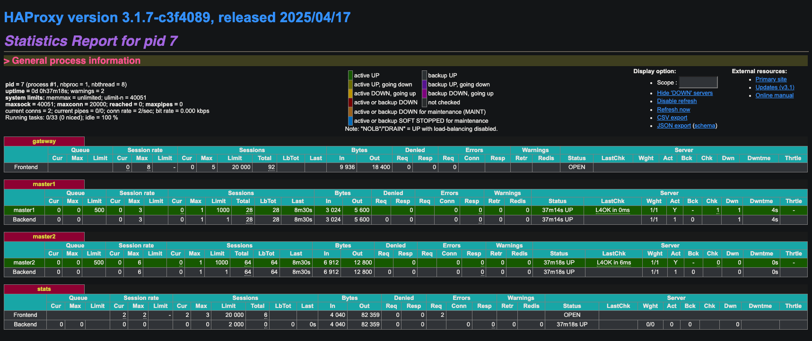

# HAProxy API Gateway for Puppet Masters

## Overview

In large-scale Puppet deployments with multiple Puppet Masters, nodes may be dynamically reassigned between masters. PuppetDB isn't optimized for per-request lookups and does not provide dynamic routing out of the box. 

This project uses HAProxy as an API Gateway with runtime map reloads, to avoid per-request database hits.

## Background
todo

## Problem

1. **Dynamic Puppet Master assignment:** users move nodes between Puppet Masters (`puppet agent -t`), without coordination
2. **High lookup frequency:** Querying PuppetDB on every API call causes latency spikes and heavy DB load
3. **Static load balancers** cannot handle per‑node master assignment

## Alternative Approaches

| Approach                               | Pros                   | Cons                                                                  |
|----------------------------------------|------------------------|-----------------------------------------------------------------------|
| Query PuppetDB per request             | Always up-to-date      | High latency, DB load, scaling issues                                 |
| NGINX            | Advanced HTTP features | New workers have to be created on every change, no built‑in TCP queue |
| Service Registry (e.g., Consul, Eureka) | Always up-to-date      | Additional infrastructure, complexity                                 |
| Custom Gateway                         | Tailored               | Significant development effort and maintenance overhead               |

## Proposed Solution

1. **HAProxy API Gateway**: a single entry point for all requests, routing to the correct master based on a map file
2. **Map updater**: a cron that polls PuppetDB every minute, writes the new mapping file, and uses HAProxy’s Runtime API to atomically reload the map

### Benefits

- **Zero per-request DB hits**: in memory map lookup is O(1)
- **Runtime reloads**: update mapping without process restarts
- **Horizontal scalability**: multiple HAProxy instances can share the same map file
- **Built‑in monitoring**: HAProxy provides dashboards and can be integrated with Prometheus
- **No node side changes**: clients only need to set a HTTP header (e.g., `X-Node-Name`)

## Limitations & Considerations

### Eventual Consistency
- Map updates occur on every minute.
- If a node moves to a different master, requests may still route to the old master until the next polling cycle updates the map (to be fixed with redispatch)
- Manual map reloads can be triggered via API if immediate consistency is required

### HAProxy maxqueue and maxconn

#### maxconn
- maxconn limits concurrent connections HAProxy manages, each consumes a file descriptor and memory
- Hard limit is `ulimit -n`

#### maxqueue
- Internal in memory FIFO queue for buffering connections to the Puppet Masters
- Returns 503 if both the queue and maxconn are full
- HTTP requests waiting in the queue can be [prioritized](https://www.haproxy.com/documentation/haproxy-configuration-tutorials/performance/overload-protection/#http-request-priority-queue)
- Question, can this be configured at runtime?

### Redispatch
[WIP](https://www.haproxy.com/documentation/haproxy-configuration-tutorials/reliability/retries/#redispatch-to-a-different-server)
todo: add redispatch to config, current version will FAIL if map isn't up-to-date
```
frontend gateway
    use-server puppet %{var(txn.node)}

backend puppet
    option redispatch
    server master1 master1:3001 check maxconn 1000 maxqueue 500
    server master2 master2:3002 check backup
```

### Scalability
To research: running HAProxy in multi thread / mutli process mode

### Long vs Short polling updater
- Current implementation uses short polling (every minute) to update the map
- Long polling PuppetDB for changes to the node list can give near real-time update (probably better to use redispatch with short polling)


---

## Quickstart

1. Build
    ```bash
    docker-compose up --build -d
    ```
   
2. Verify mapping:
    ```bash
    docker exec haproxy-server cat /usr/local/etc/haproxy/node-master.map
    ```

3. Test routing:
    ```bash
    curl -s -H "X-Node-Name: node1.example.com" http://localhost:8080/
    curl -s -H "X-Node-Name: node2.example.com" http://localhost:8080/
    curl -s -H "X-Node-Name: node3.example.com" http://localhost:8080/
    curl -s -H "X-Node-Name: node4.example.com" http://localhost:8080/
    ```
   
3. **Wait for cron to reload map**:

    Alternatively, trigger manual reload

    ```bash
      docker exec map-updater /usr/local/bin/update-map.sh
    ```

4. Verify mapping and Test routing again:

     ```bash
     docker exec haproxy-server cat /usr/local/etc/haproxy/node-master.map
     ```

    ```bash
    curl -s -H "X-Node-Name: node1.example.com" http://localhost:8080/
    curl -s -H "X-Node-Name: node2.example.com" http://localhost:8080/
    curl -s -H "X-Node-Name: node3.example.com" http://localhost:8080/
    curl -s -H "X-Node-Name: node4.example.com" http://localhost:8080/
    ```

---

## View HAProxy Stats
http://localhost:8081/stats

Username: `admin` <br>
Password: `admin`



---

## References

1. [HAProxy Maps](https://www.haproxy.com/blog/introduction-to-haproxy-maps)
2. [HAProxy as an API Gateway](https://www.haproxy.com/blog/using-haproxy-as-an-api-gateway-part-1-introduction)
3. [HAProxy Runtime API](https://www.haproxy.com/documentation/haproxy-runtime-api/)
4. Airbnb [Synapse](https://medium.com/airbnb-engineering/smartstack-service-discovery-in-the-cloud-4b8a080de619#.m0x2ks9ja:~:text=consume%20a%20message.-,Synapse,-Synapse%20is%20the)

---

## Todo
- [ ] Add redispatch
- [ ] Add mock nodes
- [ ] Have a registration endpoint for nodes
- [ ] Have endpoint for command execution on a node
- [ ] Have endpoint to get all nodes
- [ ] Mock database should be updated by masters instead of setInterval
- [ ] Explore [HTTP Rewrites](https://www.haproxy.com/documentation/haproxy-configuration-tutorials/proxying-essentials/http-rewrites/)
- [ ] Add [Prometheus](https://www.haproxy.com/documentation/haproxy-configuration-tutorials/alerts-and-monitoring/prometheus/) metrics


